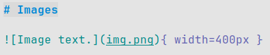

# Introduction

This document demonstrates docc's formatting capabilities for documentation,
reports, and notes.

---

# Text Formatting

## Emphasis

- _Italic text_
- **Bold text**
- _**Bold and italic**_
- ~~Strikethrough~~

## Inline Code

Use the `printf()` function to print formatted output.

# Headings

## Level 2 Heading

### Level 3 Heading

#### Level 4 Heading

\newpage

# Page margins

Lorem ipsum dolor sit amet, consectetur adipiscing elit. Sed non risus.
Suspendisse lectus tortor, dignissim sit amet, adipiscing nec, ultricies sed,
dolor. Cras elementum ultrices diam. Maecenas ligula massa, varius a, semper
congue, euismod non, mi. Proin porttitor, orci nec nonummy molestie, enim est
eleifend mi, non fermentum diam nisl sit amet erat. Duis semper. Duis arcu
massa, scelerisque vitae, consequat in, pretium a, enim.

Pellentesque congue. Ut in risus volutpat libero pharetra tempor. Cras
vestibulum bibendum augue. Praesent egestas leo in pede. Praesent blandit odio
eu enim. Pellentesque sed dui ut augue blandit sodales. Vestibulum ante ipsum
primis in faucibus orci luctus et ultrices posuere cubilia Curae; Aliquam nibh.
Mauris ac mauris sed pede pellentesque fermentum. Maecenas adipiscing ante non
diam sodales hendrerit.

Ut velit mauris, egestas sed, gravida nec, ornare ut, mi. Aenean ut orci vel
massa suscipit pulvinar. Nulla sollicitudin. Fusce varius, ligula non tempus
aliquam, nunc turpis ullamcorper nibh, in tempus sapien eros vitae ligula.
Pellentesque rhoncus nunc et augue. Integer id felis. Curabitur aliquet
pellentesque diam. Integer quis metus vitae elit lobortis egestas.

Lorem ipsum dolor sit amet, consectetur adipiscing elit. Morbi vel erat non
mauris convallis vehicula. Nulla et sapien. Integer tortor tellus, aliquam
faucibus, convallis id, congue eu, quam. Mauris ullamcorper felis vitae erat.
Proin feugiat, augue non elementum posuere, metus purus iaculis lectus, et
tristique ligula justo vitae magna.

Aliquam convallis sollicitudin purus. Praesent aliquam, enim at fermentum
mollis, ligula massa adipiscing nisl, ac euismod nibh nisl eu lectus. Fusce
vulputate sem at sapien. Vivamus leo. Aliquam euismod libero eu enim. Nulla nec
felis sed leo placerat imperdiet. Aenean suscipit nulla in justo. Suspendisse
cursus rutrum augue.

Nulla tincidunt tincidunt mi. Curabitur iaculis, lorem vel rhoncus faucibus,
felis magna fermentum augue, et ultricies lacus lorem varius purus. Curabitur eu
amet. Donec quis dui at dolor tempor interdum. Vivamus molestie gravida turpis.
Fusce lobortis lorem at ipsum semper sagittis. Nam convallis pellentesque nisl.

Integer malesuada commodo nulla. Praesent blandit laoreet nibh. Fusce convallis
metus id felis luctus adipiscing. Pellentesque habitant morbi tristique senectus
et netus et malesuada fames ac turpis egestas. Vestibulum tortor quam, feugiat
vitae, ultricies eget, tempor sit amet, ante. Donec eu libero sit amet quam
egestas semper.

Aenean ultricies mi vitae est. Mauris placerat eleifend leo. Quisque sit amet
est et sapien ullamcorper pharetra. Vestibulum erat wisi, condimentum sed,
commodo vitae, ornare sit amet, wisi. Aenean fermentum, elit eget tincidunt
condimentum, eros ipsum rutrum orci, sagittis tempus lacus enim ac dui.

Donec non enim in turpis pulvinar facilisis. Ut felis. Praesent dapibus, neque
id cursus faucibus, tortor neque egestas augue, eu vulputate magna eros eu erat.
Aliquam erat volutpat. Nam dui mi, tincidunt quis, accumsan porttitor, facilisis
luctus, metus.

# Lists

## Unordered List

- Item one
- Item two
  - Nested item
  - Another nested item
- Item three

## Ordered List

1. First step
2. Second step
   1. Sub-step
   2. Sub-step
3. Third step

## Task List

- [x] Write document
- [x] Add examples
- [ ] Review content
- [ ] Export to PDF

# Links and References

- Pandoc: <https://pandoc.org>
- GitHub: [https://github.com](https://github.com)
- Relative link: [See Configuration](#configuration)

# Images

{ width=400px }

# Blockquotes

> This is a blockquote.
>
> It can span multiple lines and is often used for notes, warnings, or quoted
> text.

# Code Blocks

## Fenced Code Block (Bash)

```bash
#!/usr/bin/env bash
echo "Hello, world"
```

## Fenced Code Block (Python)

```python
def factorial(n):
    if n <= 1:
        return 1
    return n * factorial(n - 1)
```

## Fenced Code Block (C)

```c
#include <stdio.h>

int main(void) {
    printf("Hello, world\n");
    return 0;
}
```

# Tables

| Name    | Role       | Experience (years) |
| ------- | ---------- | ------------------ |
| Alice   | Engineer   | 5                  |
| Bob     | Researcher | 3                  |
| Charlie | Manager    | 8                  |

# Horizontal Rules

---

---

---

# Footnotes

This sentence has a footnote reference.[^1]

[^1]: This is the footnote text.

# Definition Lists

Term 1 : Definition of the first term.

Term 2 : Definition of the second term. : Another definition for the same term.

# Math (LaTeX)

Inline math: $e^{i\pi} + 1 = 0$

Block math:

$$
x(t) = \int_{0}^{t} u(\tau)\, d\tau
$$

# Diagrams (Mermaid)

```{.mermaid loc=../out filename=mermaid-example width=200}
graph TD
    A[Start] --> B[Process]
    B --> C{Decision}
    C -->|Yes| D[Action A]
    C -->|No| E[Action B]
```

# Includes (Pandoc Include)

The sample cover page.

```markdown
!include cover.md
```

# Configuration

## YAML Metadata Block

```yaml
title: Sample Markdown Document
author:
  - John Doe
  - Jane Doe
lang: en
toc: true
number-sections: true
```

# Escaping Characters

To show literal Markdown characters, escape them:

- \_not italic\_
- \# not a heading
- \`not code\`
